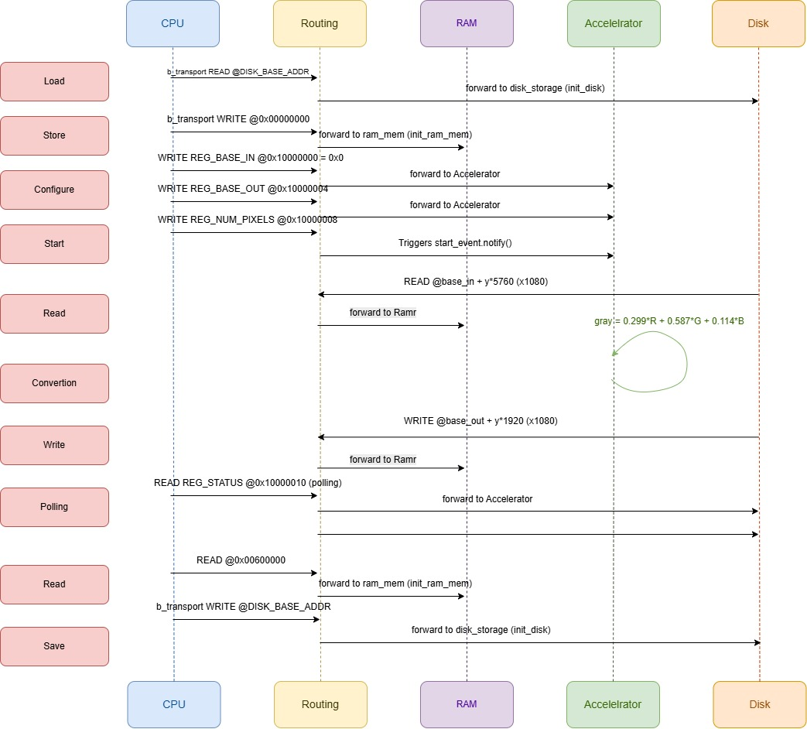

# Image processing system using SystemC and TLM 2.0

## Description

This project implements a Transaction-Level Model (TLM) of an image processing system in SystemC.

The architecture is composed of:

- Processor
- RAM Memory
- Persistent storage
- Image Processing Accelerator

The accelerator receives an RGB image stored in memory and generates a grayscale version of the same image

This assignment (3rd evaluation) adds an AXI4-Full RAM implemented in
SystemVerilog, a UVM testbench for it, and a DPI-C bridge that connects the
RTL/UVM world to the SystemC model above. See
[AXI4 RAM, UVM Testbench and DPI-C Integration](#axi4-ram-uvm-testbench-and-dpi-c-integration)
further down.

# Repository Organization
```text
.
├── README.md
├── img_1080p.png
├── input.raw
├── output.png
├── output.raw
├── systemc-image-processing-platform   # original model (evaluations 1/2, no DPI-C)
│   ├── Makefile
│   ├── build
│   │   └── main.o
│   ├── image_processor
│   └── src
│       ├── cpu.h
│       ├── defines.h
│       ├── disk_storage.h
│       ├── image_accelerator.h
│       ├── main.cpp
│       ├── ram_mem.h            # plain std::vector<uint8_t> backing store
│       └── routing.h
├── verification                 # RTL + UVM + DPI-C deliverable (evaluation 4)
│   ├── input.raw                # RAW RGB 1080p input image (place it here)
│   ├── dpi
│   │   ├── ram_model.c          # shared DPI-C RAM behavioral model
│   │   └── ram_model.h
│   ├── rtl
│   │   └── axi_ram.sv           # AXI4-Full RAM slave (DUT)
│   ├── sv_tb                    # SystemVerilog/UVM testbench for axi_ram.sv
│   │   ├── axi_if.sv
│   │   ├── axi_ram_agent.sv
│   │   ├── axi_ram_driver.sv
│   │   ├── axi_ram_dpi_import.svh
│   │   ├── axi_ram_env.sv
│   │   ├── axi_ram_monitor.sv
│   │   ├── axi_ram_pkg.sv
│   │   ├── axi_ram_scoreboard.sv
│   │   ├── axi_ram_seq_item.sv
│   │   ├── axi_ram_seq_lib.sv
│   │   ├── axi_ram_sequencer.sv
│   │   ├── axi_ram_test_lib.sv
│   │   └── tb_top.sv
│   ├── scripts
│   │   ├── build_all.sh         # builds the verification/ SystemC model + RTL/UVM in one shot
│   │   └── run_uvm_sim.sh       # xvlog/xelab/xsim automation for sv_tb/
│   └── systemc-image-processing-platform   # modified copy: ram_mem.h backed by ../dpi/ram_model.c
│       ├── Makefile
│       └── src
│           └── ram_mem.h
└── testbench
    └── main.cpp
```
# Build requirements

## Dependencies and required software
- Ubuntu
- g++ with C++17 support
- make
- pkg-config is no longer required after the Makefile update, but can still be useful
- A SystemC Instalation

## Expected SystemC layout

The Makefile now supports:

- a source-tree install:
    - headers in $(SYSTEMC_HOME)/src
    - libraries in $(SYSTEMC_HOME)/build/src/.libs
- a packaged install:
    - headers in $(SYSTEMC_HOME)/include
    - libraries in $(SYSTEMC_HOME)/lib-linux64
## Environment

- SYSTEMC_HOME should point to your SystemC root directory like: SYSTEMC_HOME=/usr/local/systemc make all

## Build Commands

From $PROJ_HOME/systemc_tlm_image_processor/image_processing_system-assignment_2/systemc-image-processing-platform:

- make clean
- SYSTEMC_HOME=/usr/local/systemc make all
- make run

## Manual compilation command

Manual compilation command:

```bash
g++ -std=c++17 -Wall -O2 -I. -I/usr/include \
    main.cpp \
    -o simulacion \
    -L/usr/lib/x86_64-linux-gnu -lsystemc \
    -Wl,-rpath=/usr/lib/x86_64-linux-gnu
```

### Run

./simulacion


# Module Organization

## Procesor 

The processor cordinates the execution flow

It is charged of:

- Read image from storage
- Transfer image to RAM
- Configure the accelerator
- Start processing
- Store final image

## RAM

Stores:

- Input RGB image
- Output grayscale image

Provides TLM target interface

## Accelerator

Responsible for RGB to grayscale conversion

The conversion is:

Gray = 0.299*R + 0.587*G + 0.114*B

It also provides memory-mapped control registers

## Storage

Persistent memory device. It loads the image from disk and save processed image.

# Block Diagram


# Sequence Diagram



# Transaction Format
The system uses TLM-2.0 Generic Payloads transactions

## Write Transaction

| Field    | Description       |
| -------- | ----------------- |
| Command  | TLM_WRITE_COMMAND |
| Address  | Target address    |
| Data Ptr | Source buffer     |
| Length   | Number of bytes   |

## Read Transaction

| Field    | Description        |
| -------- | ------------------ |
| Command  | TLM_READ_COMMAND   |
| Address  | Target address     |
| Data Ptr | Destination buffer |
| Length   | Number of bytes    |


# Memory Map

| Address Range | Module      |
| ------------- | ----------- |
| 0x00000000    | RAM         |
| 0x10000000    | Storage     |
| 0x20000000    | Accelerator |

## Accelerator Registers

| Address    | Register    |
| ---------- | ----------- |
| 0x20000000 | START       |
| 0x20000004 | STATUS      |
| 0x20000008 | INPUT_ADDR  |
| 0x2000000C | OUTPUT_ADDR |


# Results

## Input

RGB RAW Image


Resolution: 1920x1080

## Output

Grayscale Image generated by the accelerator


# AXI4 RAM, UVM Testbench and DPI-C Integration

This assignment replaces the RAM's storage with a real AXI4-Full RTL slave
(`verification/rtl/axi_ram.sv`), verified with a standard UVM/SystemVerilog
testbench (`verification/sv_tb/`), and integrates it into the SystemC model
via DPI-C. All of it lives under `verification/`.

## Toolchain

The available simulator on this machine is **Xilinx Vivado Simulator**
(`xvlog`/`xsc`/`xelab`/`xsim`), which ships UVM 1.2 and full DPI-C support -
no Verilator/Icarus install was required. Source Vivado's environment before
running any of the scripts below:

```bash
source <vivado_install>/settings64.sh
```

## Architecture and design rationale

Two independent event-driven kernels are involved here: SystemC's own
scheduler (`sc_start()`) and xsim's HDL kernel. There is no vendor bridge on
this machine that lets one call synchronously into a *live* instance of the
other (that is what commercial SystemC-HDL co-simulation products provide).
Rather than fake that, the integration is built around a single shared
DPI-C component instead:

- **`verification/dpi/ram_model.c` / `ram_model.h`** implement one 64 MB
  byte-addressable RAM behavioral model in plain C.
- The **SystemC model** (`verification/systemc-image-processing-platform/src/ram_mem.h`
  — a copy of the model moved inside `verification/` for this assignment; the
  original, unmodified copy still lives at `systemc-image-processing-platform/`
  in the repo root) links this object directly and calls its bulk pointer API
  (`ram_model_read`/`ram_model_write`) from `b_transport`, replacing the
  previous private `std::vector<uint8_t>`.
- The **UVM testbench** (`verification/sv_tb/axi_ram_dpi_import.svh`) imports
  the same functions via `import "DPI-C"` and uses them as:
  - a **golden reference model** in the scoreboard (every AXI write/read
    burst observed by the monitor is mirrored into / checked against it),
  - a **backdoor image loader/dumper** for stimulus and results
    (`ram_model_load_file`/`ram_model_dump_file`), so the exact same
    `input.raw` used by the SystemC flow can be streamed through the RTL RAM
    over real AXI4 transactions and the read-back compared byte-for-byte.
- `verification/rtl/axi_ram.sv` additionally `export`s
  `axi_ram_backdoor_read/write` via DPI-C so the DUT's own memory array can
  be peeked/poked directly if needed.

This means the RAM's canonical behavioral model is written once and is the
literal DPI-C boundary connecting the SystemC domain and the RTL/UVM domain -
satisfying "integrate the RAM module using DPI/VPI" without requiring two
simulator kernels to run concurrently in lockstep.

## `verification/rtl/axi_ram.sv`

A synthesizable AXI4-Full slave (not AXI4-Lite): separate AW/W/B and AR/R
channels, INCR burst support (up to 256 beats), per-byte write strobes,
parameterizable data width (default 32-bit) and depth (default 64 MB,
`ADDR_WIDTH=26`, matching `sys_cfg::RAM_SIZE`). Reads are registered
(BRAM-style) rather than driven from a combinational read of the full
memory array - xsim doesn't fully support sensitivity on large indexed array
reads in `always_comb`, and that pattern spins in a zero-time delta-cycle
loop instead of advancing simulation time.

## `verification/sv_tb/` UVM testbench

Standard UVM 1.2 environment against `axi_ram.sv`: `axi_if.sv` (interface
with driver/monitor clocking blocks), `axi_ram_seq_item`, `axi_ram_sequencer`,
`axi_ram_driver`, `axi_ram_monitor`, `axi_ram_agent`, `axi_ram_scoreboard`
(DPI-C golden-model checker), `axi_ram_env`, sequences and tests in
`axi_ram_seq_lib.sv`/`axi_ram_test_lib.sv`, and `tb_top.sv` as the top module.

Three tests are provided:

| Test                    | What it does                                                             |
| ------------------------ | ------------------------------------------------------------------------ |
| `axi_ram_base_test`      | Just builds the environment (sanity/compile check).                      |
| `axi_ram_random_test`    | Randomized write/read-back bursts, checked against the golden model.      |
| `axi_ram_image_test`     | Streams a real RAW RGB image through the DUT over AXI4 and dumps it back.|

The driver/monitor wait for `aresetn` to deassert before driving/sampling the
bus - starting immediately at time 0 races the reset (AXI ready signals are
asserted throughout reset since the DUT's FSMs sit idle) and silently drops
the first transaction, stalling the test forever.

## Prerequisites

| Tool | Used for | Notes |
| --- | --- | --- |
| `g++` (C++17) + `make` | SystemC model | see [Build requirements](#build-requirements) above |
| A SystemC install | SystemC model | `SYSTEMC_HOME` env var, see above |
| Xilinx Vivado (`xvlog`/`xsc`/`xelab`/`xsim`) | RTL + UVM testbench | any recent version with UVM 1.2 bundled (tested with 2024.2); Verilator/Icarus are **not** required |

Before running anything in the RTL/UVM flow, source Vivado's environment
script so `xvlog`/`xsc`/`xelab`/`xsim` are on `PATH`:

```bash
source <vivado_install>/settings64.sh
```

## Quick start (one-shot)

```bash
SYSTEMC_HOME=/path/to/systemc verification/scripts/build_all.sh
```

This builds the SystemC executable (`make -C verification/systemc-image-processing-platform clean all`)
and then does an RTL/UVM compile + `axi_ram_base_test` smoke run
(`verification/scripts/run_uvm_sim.sh axi_ram_base_test`) to confirm the whole
toolchain is wired up. It does **not** run the full system or the full UVM
regressions - do that with the commands below.

## Running the SystemC system model

```bash
cd verification/systemc-image-processing-platform
SYSTEMC_HOME=/path/to/systemc make clean all
./image_processor      # must be run from this directory: paths to
                        # ../input.raw / ../output.raw are relative,
                        # i.e. verification/input.raw and verification/output.raw
```

Place your input RAW RGB 1080p image at `verification/input.raw` before
running this — it's read from there, not from the repo root.

Expected console output (abridged):

```
Starting image proccessing simulation
@0 s [CPU] Paso 1: Cargando imagen desde disco...
@0 s [CPU] Paso 1b: Escribiendo imagen en RAM...
@0 s [CPU] Paso 2: Configurando acelerador...
@0 s [CPU] Paso 3: Iniciando acelerador...
@108 us [Acelerador] Procesamiento completo.
@108100 ns [CPU] Acelerador listo.
@108100 ns [CPU] Paso 5b: Guardando imagen en disco...
@108100 ns [CPU] Flujo completo. Deteniendo simulacion.
Finishing image proccessing simulation
```

Verify the result:

```bash
cd ..
ls -la output.raw                       # expect 2073600 bytes (1920x1080, 8bpp grayscale)
```

## Running the AXI4 RAM UVM testbench

### Option A - automated script

```bash
verification/scripts/run_uvm_sim.sh <test_name> [-- NAME=VALUE ...]
```

| Test name | Description |
| --- | --- |
| `axi_ram_base_test` | Builds the environment only (sanity/compile check). |
| `axi_ram_random_test` | Randomized write/read-back bursts vs. the golden model. Plusarg: `NUM_BURSTS` (default 50). |
| `axi_ram_image_test` | Streams a real RAW image through the DUT over AXI4. Plusargs: `IMG_PATH`, `IMG_OUT`, `IMG_BYTES` (see below). |

```bash
# AXI4 protocol regression (randomized bursts)
verification/scripts/run_uvm_sim.sh axi_ram_random_test
verification/scripts/run_uvm_sim.sh axi_ram_random_test -- NUM_BURSTS=200

# Stream input.raw through the RTL RAM over AXI4 and diff the result
verification/scripts/run_uvm_sim.sh axi_ram_image_test -- \
    IMG_PATH=../input.raw IMG_OUT=../sv_tb_output.raw IMG_BYTES=6220800
diff <(head -c 6220800 input.raw) sv_tb_output.raw && echo "identical"
```

Note: `IMG_BYTES=6220800` streams the **entire** 1920x1080 RGB888 image
(6,220,800 bytes) through individual AXI4 bursts and will take noticeably
longer to simulate than the default 256 KB subset; drop the plusargs (or
lower `IMG_BYTES`) for a quick check.

Expected passing output ends with:

```
UVM_INFO ... [SCBD_SUMMARY] bytes checked=<N> errors=0
UVM_INFO ... [SCBD_SUMMARY] *** SCOREBOARD PASSED ***
...
UVM_ERROR :    0
UVM_FATAL :    0
```

Any `UVM_ERROR`/`UVM_FATAL` (or `errors=` being nonzero) means the RTL RAM
diverged from the golden model - check the address printed in the
`SCBD_MISMATCH` message.

### Option B - manual step-by-step (what the script automates)

Useful for understanding the flow or adapting it to another simulator.
Run from a scratch work directory (e.g. `mkdir -p sim_uvm && cd sim_uvm`):

```bash
# 1. Build the DPI-C shared library from the shared RAM model
xsc -c ../verification/dpi/ram_model.c
xsc --shared -o ram_model_dpi

# 2. Compile the RTL DUT
xvlog --sv ../verification/rtl/axi_ram.sv

# 3. Compile the SystemVerilog/UVM testbench
xvlog --sv -L uvm -i ../verification/sv_tb \
    ../verification/sv_tb/axi_ram_pkg.sv ../verification/sv_tb/axi_if.sv ../verification/sv_tb/tb_top.sv

# 4. Elaborate, linking the DPI-C library
xelab -L uvm --timescale 1ns/1ps -s tb_snapshot tb_top --sv_lib ram_model_dpi

# 5. Run
xsim tb_snapshot -runall -testplusarg UVM_TESTNAME=axi_ram_random_test
```

### Viewing waveforms

Add `--debug typical` to the `xelab` step to enable waveform capture, then
open the resulting `.wdb` in the Vivado GUI:

```bash
xelab -L uvm --timescale 1ns/1ps -s tb_snapshot tb_top --sv_lib ram_model_dpi --debug typical
xsim tb_snapshot -gui   # opens the interactive waveform viewer
```

### Cleaning up

`verification/scripts/run_uvm_sim.sh` does all its work under a scratch `sim_uvm/`
directory (compiled libraries, `xsim.dir/`, logs, `.wdb` files). It's
regenerated on every run and safe to delete between runs or before
committing:

```bash
rm -rf sim_uvm
```

## Troubleshooting

- **UVM test hangs / xsim pegs the CPU with no time advancing past `@ 0`:**
  this was hit during development - the driver/monitor were issuing the
  first AXI transaction before `aresetn` deasserted, which raced the DUT's
  reset (its ready signals are asserted throughout reset since the FSMs sit
  idle) and silently dropped the transaction, so the test's objection was
  never dropped and the clock kept toggling forever. Already fixed in
  `verification/sv_tb/axi_ram_driver.sv`/`axi_ram_monitor.sv` (`wait (vif.aresetn === 1'b1);`
  before driving/sampling) - if you add new agents/components, make sure
  they wait for reset the same way.
- **`"Sensitivity on Associative Array" is not supported yet for simulation`
  warning during elaboration:** indicates a combinational read from the
  large `mem[]` array in `axi_ram.sv`; this pattern can spin instead of
  advancing time on xsim. The current RTL reads memory synchronously
  (registered, BRAM-style) specifically to avoid this - don't reintroduce a
  combinational array read.
- **`xsc --shared` reports "multiple definition of ..." when linking:**
  don't pass `-i <object>.o` to `xsc --shared` after already compiling with
  `xsc -c` into the same work directory - the linker step auto-includes
  every `.o` under `xsim.dir/work/xsc/`, so passing it again duplicates the
  symbols. Just run `xsc --shared -o <name>` with no `-i`.
- **`pkg-config: Package systemc was not found`:** the Makefile falls back
  to deriving flags from `SYSTEMC_HOME` directly (packaged
  `include`/`lib`/`lib-linux64` layout, or source-tree `src`/`build/src/.libs`
  layout) - make sure `SYSTEMC_HOME` is set and points at a valid install.

