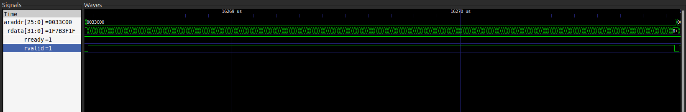
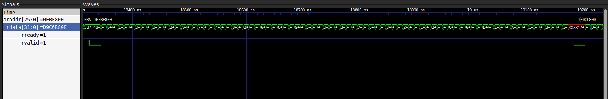

# verification/

RTL + UVM + DPI-C deliverable for **Evaluación Corta 4** (`Verificacion_Diseno_Alto_Nivel.pdf`).
Adds a real AXI4-Full RAM in SystemVerilog, verifies it with a UVM testbench,
and integrates it into a SystemC image-processing model via DPI-C.

**Note:** `./systemc-image-processing-platform/` is a **modified copy** of
the SystemC model, moved inside `verification/` for this evaluation: its
`ram_mem.h` links against `dpi/ram_model.c` (the same model the UVM
testbench imports), instead of the original internal
`std::vector<uint8_t>`. The "original" copy (evaluation 1/2, without DPI)
still lives at `../systemc-image-processing-platform/` at the repo root —
these are two independent directories on purpose, not an accidental
duplicate.


# How to run the validation

Before anything else, Vivado's environment needs to be sourced in your shell
(so that `xvlog`/`xsc`/`xelab`/`xsim` are on the `PATH`):

```bash
source <path_to_your_vivado_install>/settings64.sh
```

From inside the `verification/` folder, there are two main tests that can be
run with `scripts/run_uvm_sim.sh`:

- **Good case** — runs the AXI accelerator transforming the image with no
  errors injected:
  ```bash
  ./scripts/run_uvm_sim.sh axi_ram_image_test -- IMG_PATH=../input.raw IMG_OUT=../sv_tb_output.raw IMG_BYTES=6220800
  ```

  Example of the AXI read-data waveform for this case (`gtkwave
  sim_uvm/waves.vcd`), showing a normal burst transaction with `rvalid`
  toggling cleanly and no scoreboard mismatches:

  

  Example of the results in the log:
  ```
  UVM_INFO ... [SCBD_SUMMARY] bytes checked=<N> errors=0
  UVM_INFO ... [SCBD_SUMMARY] *** SCOREBOARD PASSED ***
  ...
  UVM_ERROR :    0
  UVM_FATAL :    0
  ```


- **Bad case** — runs a test with a fault deliberately injected in the
  testbench, to see how the scoreboard catches it:
  ```bash
  scripts/run_uvm_sim.sh axi_ram_fault_injection_test
  ```

  Example of the AXI read-data waveform for this case (`gtkwave
  sim_uvm/waves.vcd`), showing the burst read from `araddr=0xFBF800` whose
  mismatched byte the scoreboard flags:

  


  Any `UVM_ERROR`/`UVM_FATAL` (or `errors=` being nonzero) means the RTL RAM
  diverged from the golden model - check the address printed in the
  `SCBD_MISMATCH` message.

To view the waveform of the run:

```bash
gtkwave sim_uvm/waves.vcd
```

And to see the mismatches reported by UVM (`UVM_ERROR`/`UVM_FATAL`), they're
logged in:

```
sim_uvm/mismatches.log
```


### Cleaning up

`verification/scripts/run_uvm_sim.sh` does all its work under a scratch `sim_uvm/`
directory (compiled libraries, `xsim.dir/`, logs, `.wdb` files). It's
regenerated on every run and safe to delete between runs or before
committing:

```bash
rm -rf sim_uvm
```